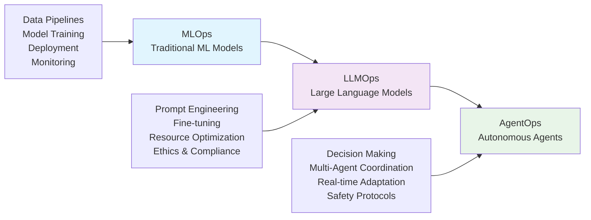
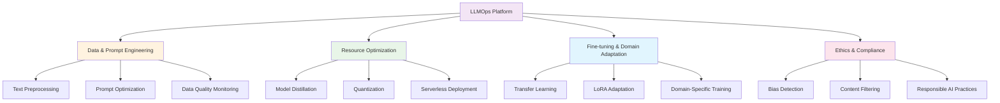
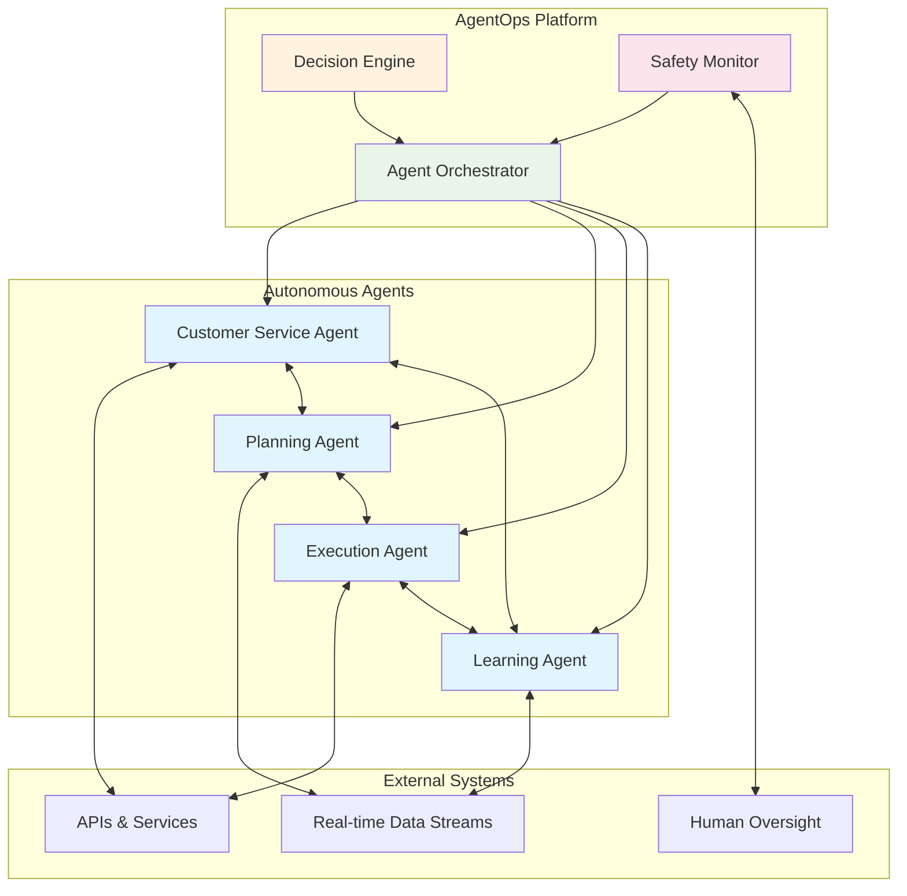
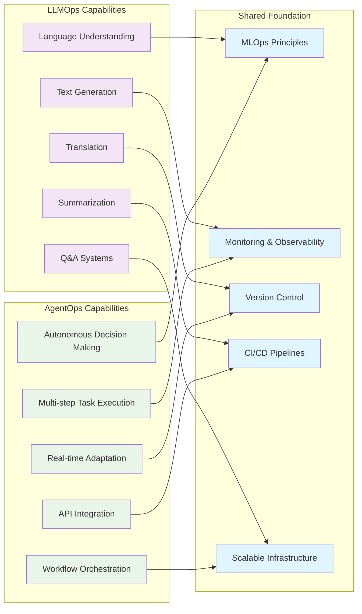

## The Evolution of AI Operations

## What is [[LLMOps]]?

**[[LLMOps]] (Large Language Model Operations)** extends traditional [[MLOps]] principles to handle the unique challenges of deploying and managing large-scale language models like [[GPT]], [[BERT]], and [[LLaMA]]. Unlike conventional machine learning models, LLMs require specialized infrastructure, sophisticated [[Prompt Engineering]], and robust ethical safeguards.

### LLMOps Architecture and Components

### Key Components of LLMOps

- **Data and [[Prompt Engineering]]**: Advanced text preprocessing and prompt optimization for better model accuracy
- **Resource Optimization**: [[Model Distillation]], [[Quantization]], and serverless deployment to manage computational costs
- **[[Fine-tuning]] and Domain Adaptation**: [[Transfer Learning]] and techniques like [[LoRA]] (Low-Rank Adaptation) for specific use cases
- **Ethics and Compliance**: [[Bias Detection]], [[Content Filtering]], and [[Responsible AI]] practices

## What is [[AgentOps]]?

**[[AgentOps]] (Agent Operations)** represents the next evolution in AI operations, enabling the deployment of autonomous agents that perform complex tasks with minimal human intervention. These agents can integrate with APIs, make real-time decisions, and adapt to dynamic environments.

### AgentOps Architecture and Multi-Agent Ecosystem

### Key Components of AgentOps

- **Decision-Making and Planning**: [[Reinforcement Learning]] and [[Hierarchical Planning]] for complex task execution
- **[[Multi-Agent Coordination]]**: Task orchestration and inter-agent communication for collaborative workflows
- **[[Real-time Adaptation]]**: [[Continual Learning]] from streaming data and sensor integration
- **Safety and Ethical Constraints**: [[Human-in-the-loop]] monitoring and [[Explainable AI]] for transparency

## LLMOps vs AgentOps: Capabilities Comparison

## Why Are LLMOps and AgentOps Important?

### 1. **Scalability and Reliability**

Both LLMOps and AgentOps provide frameworks for scaling AI solutions reliably across enterprise environments, ensuring consistent performance as demands grow.

### 2. **Cost Optimization**

- **LLMOps** reduces computational costs through model optimization and efficient resource management
- **AgentOps** automates complex processes, reducing human labor costs and improving efficiency

### 3. **Competitive Advantage**

Organizations implementing these operational frameworks can:

- Improve customer experiences through intelligent automation
- Accelerate innovation with autonomous decision-making systems
- Optimize business processes with AI-driven insights

### 4. **Risk Management**

Both frameworks emphasize:

- Ethical AI deployment with bias detection and mitigation
- Safety protocols and human oversight mechanisms
- Compliance with regulatory requirements

### 5. **Future-Proofing**

As AI continues to evolve toward more autonomous and powerful systems, LLMOps and AgentOps provide the operational foundation needed to adapt and scale responsibly.

## The Evolution: [[MLOps]] → [[LLMOps]] → [[AgentOps]]

This progression represents a fundamental shift in AI operations:

- **[[MLOps]]**: Reliable deployment of traditional ML models
- **[[LLMOps]]**: Specialized operations for language models with enhanced capabilities
- **[[AgentOps]]**: Autonomous agents capable of independent decision-making and complex task execution

Together, these frameworks enable organizations to harness the full potential of AI while maintaining control, transparency, and ethical standards.

---

*Sources: [Comprehensive Guide to MLOps, LLMOps, and AgentOps](https://www.linkedin.com/pulse/comprehensive-guide-mlops-llmops-agentops-sanjay-kumar-mba-ms-phd-kzhxc) and [MLOps → LLMOps → AgentOps: Operationalizing the Future of AI Systems](https://medium.com/@jagadeesan.ganesh/mlops-llmops-agentops-operationalizing-the-future-of-ai-systems-93025dbfde52)*
